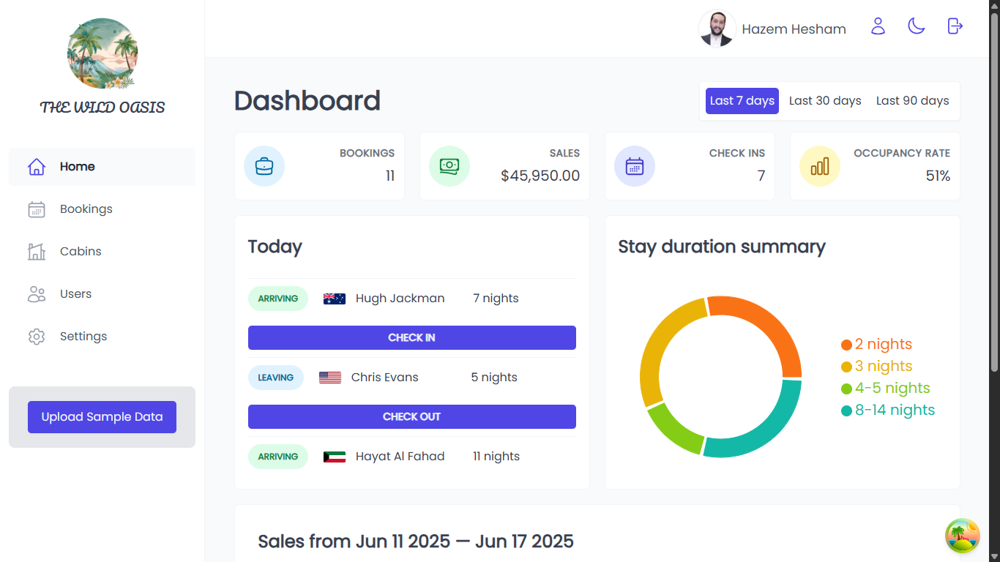
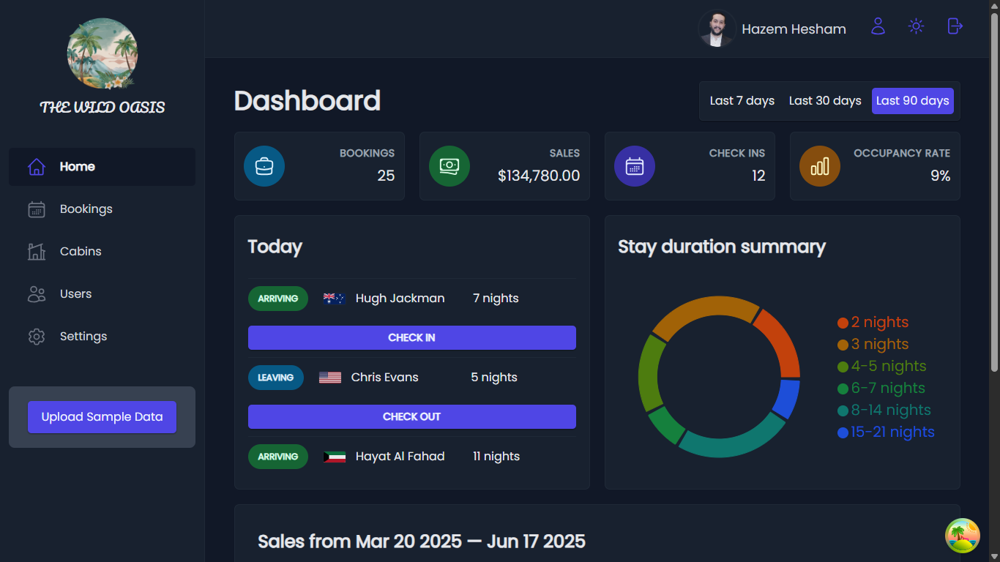
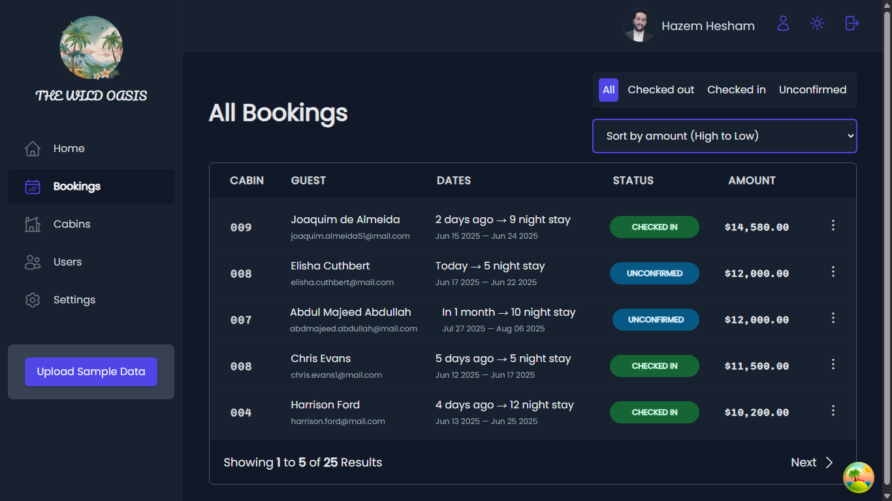
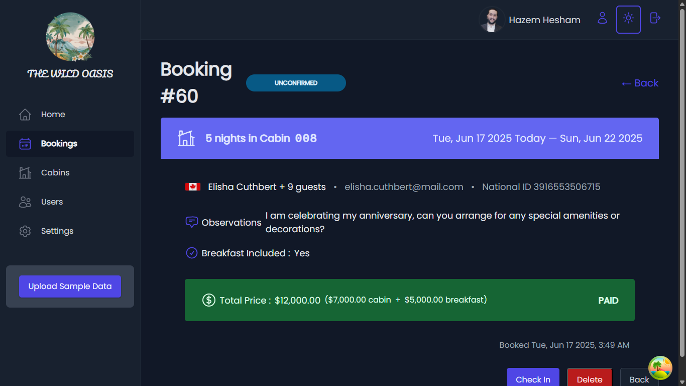
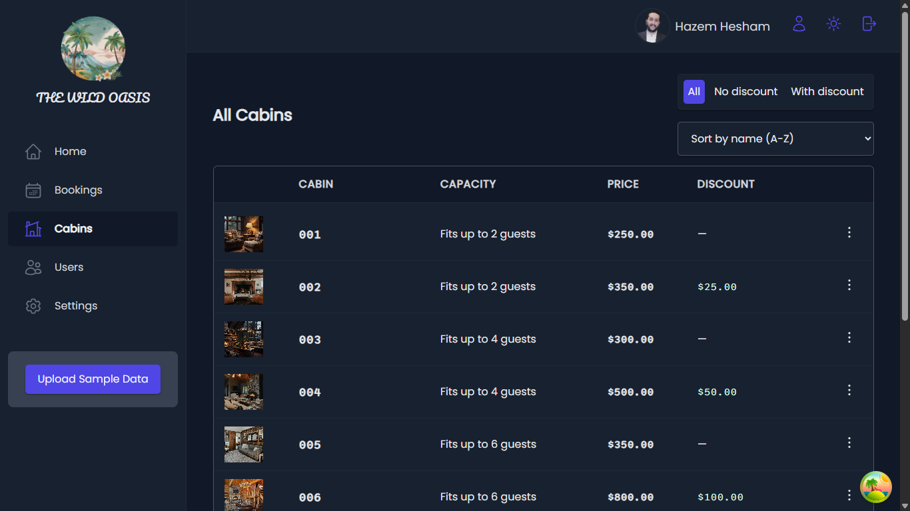
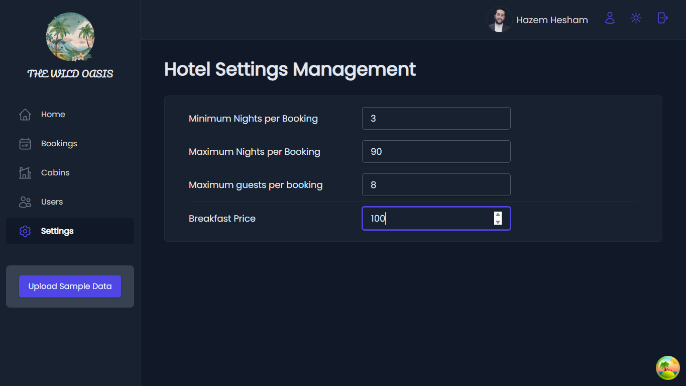
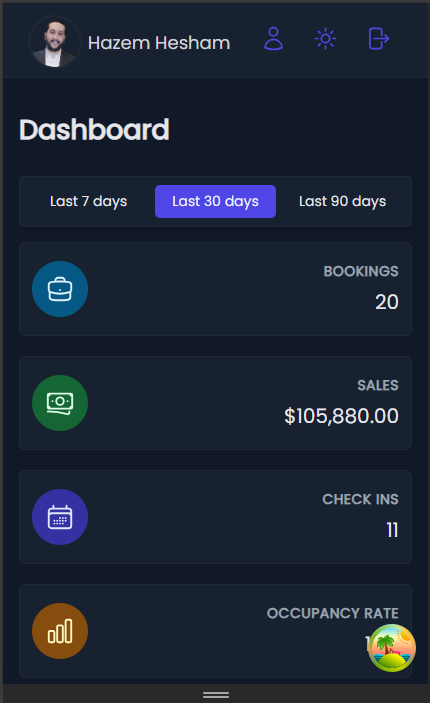
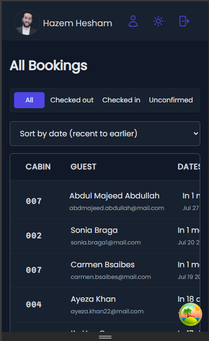
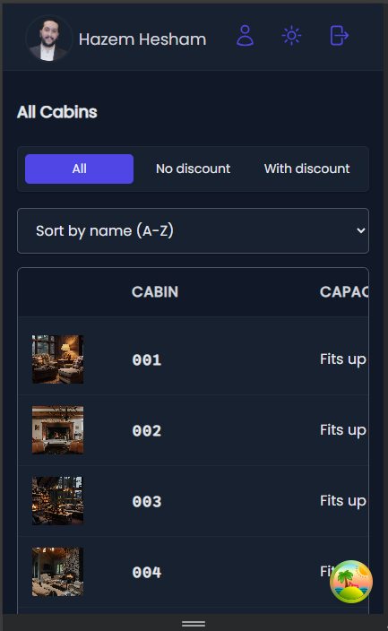

<div align="center">
    
    <h2>🏨 Wild Oasis (Egypt)</h2>
    <h3>
        <a href="https://wild-oasis-egypt.vercel.app">
            <strong>🌴 Live Site 🌴</strong>
        </a>
    </h3>
</div>


<div align="center">


</div>


<p align="center">
    Welcome to <strong>Wild Oasis</strong> – a hotel management web application designed to simplify daily operations for hotel employees. This system allows users to manage cabins/rooms, bookings, and staff details easily.
</p>


<a align="center" href="https://wild-oasis-egypt.vercel.app">



</a>


## 📋 Overview

**Wild Oasis** is a Hotel Management Web Application - built with **React** and powered by **Supabase**. It implements advanced React techniques such as **Higher-Order Components (HOCs)** and **React Query** for efficient data fetching and state management. It also integrates authentication, real-time database storage, and modern UI features like **dark mode**.


## 🌟 Project Features

- **🔐 User Authentication**
    - **Login Page:** Authenticated users can log in with their credentials.
    - **Sign-up Feature:** Only authenticated users can create new user accounts.

- **📊 Interactive Dashboard**
    - View recent bookings, sales, and occupancy rate.
    - Employees can manage guests' check ins & outs from dashboard.
    - Track performance using visual statistics with charts displaying sales and stay duration.
    - All statistics are filterable by time (e.g., last 7, 30, or 90 days).

- **📅 Booking Management**
    - Check-in, check-out, or delete a booking.
    - Supports **sorting**, **filtering**, and **pagination**.

- **🏕️ Cabin/Room Management**
    - Create, update, or delete cabin/room records.

- **⚙️ Application Settings**
    - Employees can configure global settings like breakfast price, maximum guests per cabin/room, and minimum booking length.

- **🙋‍♂️ Profile Management**
    - Employees can manage their profiles easily, including uploading avatars and changing passwords.

- **📱 Fully Responsive Design**
    - The app is mobile-friendly and optimized for all screen sizes, including:
        - Mobile phones.
        - Tablets.
        - Desktop computers.
        - Large screens (e.g., TVs or external monitors).

- **⚡ Real-Time Updates**
    - Live updates using Supabase for bookings, cabins, and user interactions.

- **🌙 Dark/Light Mode**
    - Supports both dark and light themes for a personalized user experience.
    - Automatic theme detection based on the user’s system theme preferences.


## 📸 Screenshots

### 🏠 Dashboard
<div align="center" display="flex">
    
    
</div>

### 📅 Booking Management
<div align="center" display="flex">
    
    
</div>

### 🛏️ Cabin/Room Management
<div align="center" display="flex">
    
</div>

### ⚙️ Application Settings
<div align="center" display="flex">
    
</div>

### 📱 Mobile Responsive Design
<div align="center" display="flex">
    
    
    
</div>


## 🚀 Live Site (Hotel Admin Version)

You can access the live application here: 👉 **[Wild Oasis - Egypt](https://wild-oasis-egypt.vercel.app)**
<br><br>
Use the following credentials to access the app:

- **Email Address:** `test@company.org`
- **Password:** `12345678`


## 🛠️ Tech Stack

- **React:** JavaScript Frontend library.
- **Vite:** Fast development environment and build system.
- **Supabase:** Backend-as-a-Service (database, CRUD operations, authentication, real-time updates).
- **React Query:** Data fetching, caching, and synchronization.
- **React Router:** Client-side routing and navigation.
- **React Hook Form:** Lightweight, performant form handling.
- **Recharts:** Charting library for data visualization.
- **Styled Components:** CSS-in-JS for styling the UI.
- **Netlify** / **Vercel:** Platforms for hosting and continuous deployment.


## 📦 Setup Instructions

To run this project locally:

1. Clone the repository:
    ```bash
    git clone https://github.com/hazemhesham-1/wild-oasis.git
    ```
2. Navigate to the project directory:
    ```bash
    cd wild-oasis
    ```
3. Install the dependencies:
    ```bash
    npm install
    ```
4. Set up environment variables:
   - Configure Supabase and add the necessary environment variables in a `.env.local` file. Check out the `.env.vars` for reference.
5. Run the development server:
    ```bash
    npm run dev
    ```
6. Open your browser and navigate to [http://localhost:5173/](http://localhost:5173/).


## 👥 Customer Version

Please check out the **Customer Version** of **Wild Oasis** web application, designed for guests to explore cabins and make bookings.

### 📎 Project Links

- 🔗 **Live Site:** [Wild Oasis](https://wild-oasis-egy.vercel.app)
- 📂 **Repository:** [Wild Oasis (customer version)](https://github.com/hazemhesham-1/wild-oasis-customer)


---


Thank you for checking out **Wild Oasis (Admin Version)**. Hope you enjoy exploring the project!

📬 **Feel free to contact me** if you have any questions.

**GitHub:** [hazemhesham-1](https://github.com/hazemhesham-1)